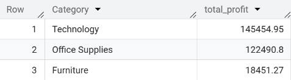

# 📊 Superstore Sales Analysis

## 📌 Objective
The aim of this project is to analyse Superstore sales data to identify key trends in revenue, profitability, and regional performance, and provide data-driven recommendations to improve business outcomes.

---

## 📂 Dataset
The dataset contains transactional sales data, including:
- Orders
- Products
- Sales
- Profit
- Regions
- Order dates

---

## 🔍 Key Questions
- Which products and categories generate the most revenue?
- Which regions and segments are the most profitable?
- How do sales change over time?
- How do discounts impact profitability?

---

## 📈 Key Insights
- Total sales reached **$2.29M**, with the **West region leading** at $725K  
- A small number of customers contribute significantly to revenue, with top customers generating over $25K individually  
- The **Canon imageCLASS 2200 Advanced Copier** is the highest-performing product, generating over $61K in sales  
- Sales fluctuate significantly month-to-month, with noticeable peaks indicating seasonality  
- **Technology** is the most profitable category ($145K), while **Furniture significantly underperforms** ($18K)  
- Higher discounts have a strong negative impact on profitability, with discounts above 40% resulting in losses
- ### 📊 Category Performance

---

## 💡 Recommendations
- Focus on high-performing regions like the West to maximise revenue opportunities  
- Implement strategies to retain and grow high-value customers  
- Reduce heavy discounting, particularly above 40%, to protect profit margins  
- Reassess the Furniture category to improve profitability or adjust pricing strategy  
- Align business operations with peak sales periods to maximise performance  

---

## 🛠 Tools Used
- SQL (data querying and analysis)
- Excel / Power BI (data visualisation, if applicable)

---

## 📁 Project Structure
- `queries.sql` – SQL queries used for analysis  
- `data/` – Dataset used for the project  
- `outputs/` – Query results or visualisations  

---

## 🚀 Summary
This project demonstrates the use of SQL to analyse real-world sales data and extract actionable business insights to support decision-making.
