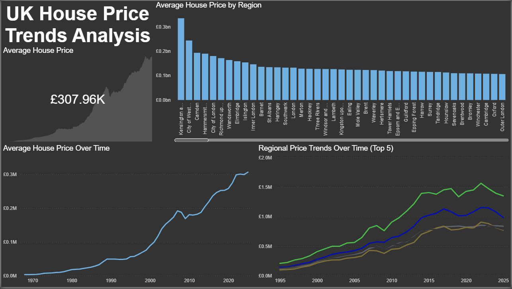

# 📊 UK House Price Trends Analysis (Power BI)

## 📌 Objective
The goal of this project is to analyse UK house price data to identify trends over time, regional differences, and areas of strongest growth.

---

## 📂 Dataset
- Source: HM Land Registry (UK House Price Index)
- Data includes:
  - Region Name
  - Date
  - Average House Price

---

## 📊 Dashboard Overview
This Power BI dashboard provides:

- Overall UK house price trend over time
- Comparison of average house prices by region
- Regional growth trends across the UK
- Key KPI showing the latest average UK house price

---

## 📈 Key Insights
- Average UK house price: **£307,960**
- **Kensington & Chelsea** is the most expensive region, followed by Camden 
  and City of Westminster
- Prices have risen consistently since 1970, with the sharpest acceleration 
  post-2000
- Top 5 regions (Kensington, Camden, Westminster, Hammersmith, City of London) 
  all exceed £1M average by 2023
- Growth rates vary significantly — outer London and regional areas lag 
  considerably behind prime London

---

## 💡 Recommendations
- Monitor high-growth regions for investment opportunities
- Consider affordability challenges in high-price areas like London
- Analyse slower-growing regions for potential development opportunities
- Align business or investment strategies with regional trends

---

## 🛠 Tools Used
- Power BI (data visualisation & dashboard creation)

---

## 📸 Dashboard Preview

---

## 🚀 Summary
This project demonstrates the ability to analyse time-series and regional data, build interactive dashboards, and communicate insights effectively using Power BI.
