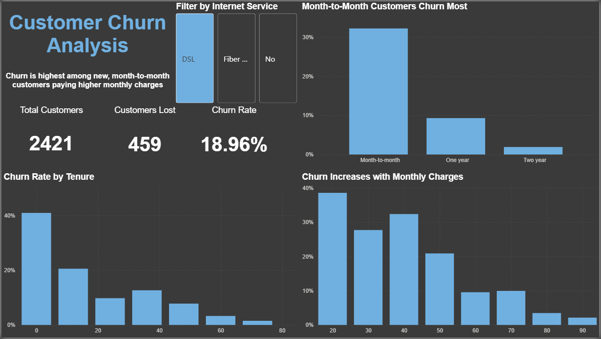

# 📊 Customer Churn Analysis (Power BI)

## 📌 Objective
The goal of this project is to analyse customer churn behaviour and identify key factors driving customer loss.

---

## 📂 Dataset
- Source: IBM Telco Customer Churn dataset
- Includes: customer demographics, contract type, tenure, and monthly charges

---

## 📊 Dashboard Overview
This dashboard explores customer churn across multiple dimensions:

- Churn by contract type
- Churn by tenure
- Churn by monthly charges
- Interactive filtering by internet service

---

## 🔍 Key Insights
- Overall churn rate: **26.54%** (1,869 of 7,043 customers lost)
- Month-to-month customers churn at ~**42%** — significantly higher than 
  one-year or two-year contract holders
- New customers are most at risk — churn exceeds **45%** in the lowest 
  tenure bracket, dropping steadily with loyalty
- Churn increases as monthly charges rise, with the highest rates seen 
  above $60/month

---

## 🛠 Tools Used
- Power BI
- DAX (for churn rate calculation)
- Data modelling & visualisation

---

### Full Dashboard

### Filtered View

---

## 🚀 Outcome
This project demonstrates the ability to:
- Analyse customer behaviour
- Identify key business risks
- Communicate insights through dashboards
