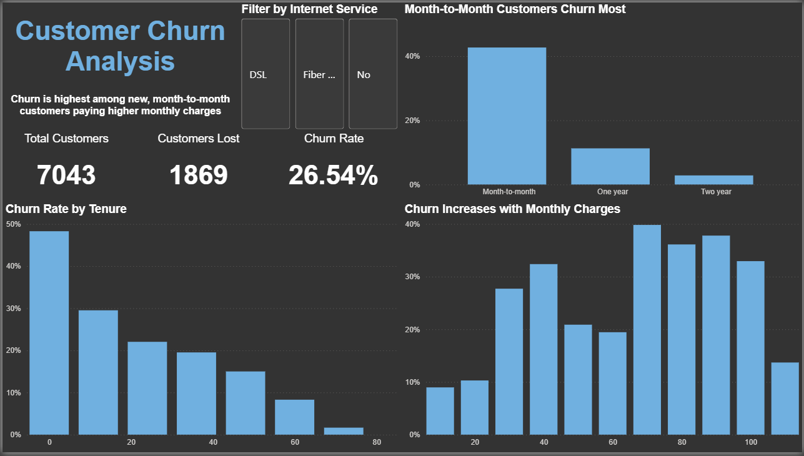

# 📊 Customer Churn Analysis (Power BI)

## 📌 Objective
The goal of this project is to analyse customer churn behaviour and identify key factors driving customer loss.

---

## 📂 Dataset
- Source: IBM Telco Customer Churn dataset
- Includes: customer demographics, contract type, tenure, and monthly charges

---

## 📊 Dashboard Overview
This dashboard explores customer churn across multiple dimensions:

- Churn by contract type
- Churn by tenure
- Churn by monthly charges
- Interactive filtering by internet service

---

## 🔍 Key Insights
- Customers on **month-to-month contracts** have the highest churn rates
- **New customers** are significantly more likely to churn
- Customers with **higher monthly charges** tend to churn more

---

## 🛠 Tools Used
- Power BI
- DAX (for churn rate calculation)
- Data modelling & visualisation

---

## 📷 Dashboard Preview

---

## 🚀 Outcome
This project demonstrates the ability to:
- Analyse customer behaviour
- Identify key business risks
- Communicate insights through dashboards
